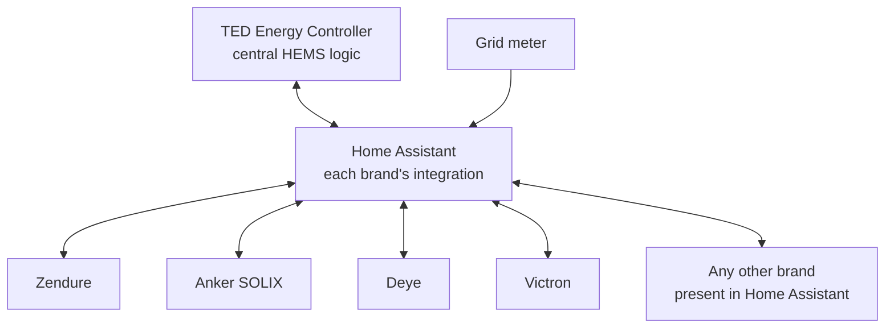

# TED Energy Controller — multi-brand HEMS for Home Assistant

**Control all your solar inverters and home batteries, whatever their brand, as one
virtual battery — locally, from Home Assistant.**

[Version française plus bas](#en-français) · Website: <https://ted-energy.fr/en/> ·
Live demo: <https://ted-energy.fr/en/live-demo>

TED Energy Controller is a home energy management system (HEMS) that runs next to
Home Assistant. It reads your grid meter every few seconds, computes a single
charge or discharge setpoint and shares it between all your inverters and
batteries (Zendure, Anker SOLIX, Marstek, Deye, Huawei, Victron, SMA…) to keep the
grid around your target, such as zero export, and use your own solar production.

## How it works

Home Assistant provides the devices; TED Energy Controller provides the central
HEMS logic.



TED does not talk to the devices itself: it uses the entities each brand's Home
Assistant integration already exposes (state of charge, power values, a
controllable setpoint). Any brand present in Home Assistant can therefore join
the control loop, with no extra hardware. A device that cannot be controlled is
included read-only (monitored).

## Features

- **Virtual battery**: batteries of different brands controlled as one setpoint.
  Only the devices needed are used (the emptiest first when charging) and the
  power is shared according to each one's maximum power.
- **Autonomous mode**: grid power regulated around a target, for example 0 W
  (zero export), single or different depending on the time of year.
- **Assisted mode**: one manufacturer's HEMS keeps control of its devices, TED
  adds the other batteries as reinforcement.
- **Scheduled charging**: weekly calendar, or automatic off-peak hours (French
  HP/HC and Tempo tariffs).
- **Per-device limits**: maximum charge and discharge power, minimum and maximum
  state of charge; a faulty device is excluded, then retested automatically.
- **Clusters, zones and three-phase grids** (sum of phases or phase by phase).
- **Surplus automations** (nested AND / OR rules, Home Assistant actions,
  webhooks), notifications, energy report in kWh and €, PDF reports, Android
  companion app.
- Runs **locally**: measurements stay at home.

## Install

### Home Assistant OS (recommended)

[](https://my.home-assistant.io/redirect/supervisor_add_addon_repository/?repository_url=https://github.com/LaurentFoulon/ted-home-assistant)

Or add this repository address to the Home Assistant app store (menu **⋮** →
**Repositories**): `https://github.com/LaurentFoulon/ted-home-assistant`, then install **TED Energy Controller**. Home
Assistant then announces every new version of TED by itself.

### Docker (NAS, mini-PC, Raspberry Pi…)

The same image is published on Docker Hub for Intel/AMD (amd64) and ARM64:

```bash
docker pull tedenergy/ted:latest
```

```bash
docker run -d --name ted-bot --restart unless-stopped -p 5002:5000 -v /path/to/ted:/data tedenergy/ted:latest
```

Open `http://<machine>:5002`: a setup wizard asks for the free license, the Home
Assistant address and a long-lived access token. Synology without the command
line: <https://ted-energy.fr/en/installation/synology>

### Requirements

- Home Assistant on your local network.
- Your inverters and batteries visible in Home Assistant through their brand's
  integration.
- A grid meter visible in Home Assistant, or a Shelly energy meter.
- An always-on machine (Home Assistant OS, NAS, mini-PC, Raspberry Pi).

## How it compares

- **EMHASS** optimises a schedule from forecasts and prices and publishes
  setpoints that your automations apply; TED regulates in real time and shares
  the power across all batteries itself.
- **Predbat** plans charging around tariffs and forecasts for supported
  inverters; TED focuses on making devices of different brands work as one.
- **evcc** is first an electric car charging manager.
- **Omnibattery** talks directly to a list of supported batteries; TED uses the
  entities any Home Assistant integration already exposes, and can keep a
  manufacturer HEMS in place.

Full comparison: <https://ted-energy.fr/en/home-assistant-hems-comparison>

## License

TED Energy Controller is proprietary software (all rights reserved), free to
use: FREE license with no time limit (2 controlled inverters, unlimited monitored
devices) and an ACCESS license offered to try everything without limits. Its
interface is currently in French.

This repository only contains the Home Assistant app description
(`ted/config.yaml`, documentation, icons, translations). The program itself is
distributed as a compiled Docker image (`tedenergy/ted`), without source code.

## Links

- What is a multi-brand HEMS? <https://ted-energy.fr/en/home-assistant-hems>
- Compatibility: <https://ted-energy.fr/en/compatibility>
- Community (Discord): <https://discord.gg/BNy9QkPMkZ>
- Roadmap and votes: <https://ted-energy.fr/en/roadmap>

---

## En français

**TED Energy Controller est un HEMS multi-marques pour Home Assistant** : il
pilote ensemble tous vos onduleurs et batteries solaires, quelle que soit leur
marque, comme une seule batterie. Il lit votre compteur toutes les quelques
secondes, calcule une consigne unique et la répartit entre tous les appareils
pour garder le réseau autour de votre cible (zéro injection) et consommer votre
propre production. Home Assistant fournit les appareils, TED apporte la logique
de régulation commune.

### Installer TED dans Home Assistant OS

Bouton **Add the TED repository** ci-dessus, ou à la main :

1. **Paramètres → Applications → Boutique** → menu **⋮** → **Dépôts**.
2. Ajoutez l'adresse : `https://github.com/LaurentFoulon/ted-home-assistant`
3. Installez **TED Energy Controller**, puis suivez l'onglet **Documentation**.

Home Assistant signale ensuite automatiquement chaque nouvelle version de TED.

### Docker (NAS, mini-PC, Raspberry Pi…)

Image Docker Hub `tedenergy/ted` (Intel/AMD et ARM64), commandes ci-dessus. Guide :
<https://ted-energy.fr/installation>

### Pour aller plus loin

- Qu'est-ce qu'un HEMS multi-marques ? <https://ted-energy.fr/hems-home-assistant>
- Comparatif (EMHASS, Predbat, evcc, Omnibattery) :
  <https://ted-energy.fr/comparatif-hems-home-assistant>
- Licence gratuite, documentation : <https://ted-energy.fr>
- Communauté Discord : <https://discord.gg/BNy9QkPMkZ>

TED est un logiciel propriétaire gratuit (tous droits réservés) ; ce dépôt ne
contient que la description de l'application pour Home Assistant, sans code
source.
